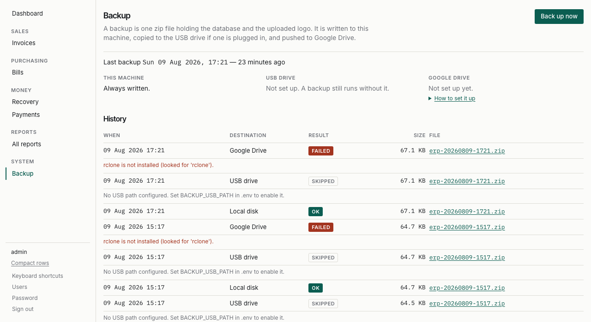

# Administering the ERP

Logins, permissions, backups, year-end, and what to do when something is wrong.

Installing on the Windows PC is `deploy/windows/INSTALL-WINDOWS.md`. Day-to-day
use is [USER-GUIDE.md](USER-GUIDE.md).

Everything here needs the **Admin** group.

---

## Logins and permissions

### The five roles

Seeded on first migrate, and **never removed** by an upgrade — a live
installation will have tuned a group, and a seed that "corrected" it would be a
support call.

| Group | For | Can post | Can cancel / amend | Sees cost prices |
| ----- | --- | -------- | ------------------ | ---------------- |
| **Admin** | You | yes | yes | yes |
| **Accountant** | The books | yes | **yes** | yes |
| **Operator** | The counter | yes | no | no |
| **Booker** | On a route | yes, own routes | no | no |
| **Viewer** | Read-only | no | no | no |

**Posting is not editing, and cancelling is separate from both.** An operator
writes bills all day and can reverse nothing. That is deliberate, and it is the
main reason not to put everybody in Admin.

### Creating a login

**Users** in the sidebar → **Add user**.

1. Username and a password you choose.
2. Add them to exactly one group from the table above.
3. If they are a booker, set **Seller** on their profile — this is what limits
   them to their own routes.

They will be made to change the password the first time they sign in. Until they
do, every page redirects to the password screen.

> **A booker with no seller set sees nothing at all.** That is on purpose: the
> unsafe default for "which routes are theirs" is "all of them".

### Changing what a group can do

Django's admin → **Groups**. Adding a permission takes effect immediately.

The rule the system holds itself to: **a menu never offers what a click would
refuse.** The sidebar, the view and the button all read the same permission, so
removing one hides the entry rather than producing a 403.

---

## Backups

Full detail, including how to restore, is in `deploy/README.md`. The short
version:

- A backup runs **every night at 21:00** through Task Scheduler, writing to the
  hard disk, the USB drive if one is plugged in, and Google Drive.
- Retention is **14 daily, 8 weekly, 12 monthly**.
- **Backup** in the sidebar shows when the last one was and every attempt since.
  If the last successful backup is more than 48 hours old the line turns rust.



Things worth knowing:

- **An unplugged USB drive is logged as skipped, not failed.** The backup still
  ran and still uploaded.
- **Downloading a backup needs the restore permission**, not just the backup
  one. The file is every price, every customer and every posting.
- Press **Back up now** before anything risky — a year-end close, a bulk price
  change, a Windows update.

---

## The nightly integrity check

At **21:05**, five minutes after the backup, `check_integrity` runs and asks the
books five questions:

1. Does the trial balance sum to zero?
2. Does every voucher balance on its own?
3. Does every ledger entry point at a document that still exists?
4. Do the stock balances match the sum of their entries?
5. Does every posted document actually have ledger entries?

The result is recorded and shown on the dashboard. **A green result is not
shown** — a banner people see every day is a banner they stop reading.

### When the books do not balance

A red banner on the dashboard means one of those five failed.

The application cannot cause this on its own: the ledger is append-only, every
posting balances inside its own transaction, and a posted document cannot be
edited. So the cause is almost always outside it — a half-finished restore, a
database file copied while the service was running, or a disk problem.

1. **Stop posting.** Tell the counter.
2. Run it by hand to see the detail:
   ```
   .venv\Scripts\activate
   python manage.py check_integrity
   ```
   It names the documents.
3. **Nothing is changed automatically.** It only looks.
4. Restore last night's backup onto a copy and run the check against that, to
   find out whether the problem is recent.
5. Call whoever supports the system, with the list.

---

## Year-end

Closing a year brings every income and expense account to zero and carries the
profit to Retained Earnings, so the next year starts from nothing.

**Do it after the accountant has finished with the year, not before.**

### Always dry-run first

```
.venv\Scripts\activate
python manage.py close_fiscal_year 2026 --dry-run
```

This writes nothing. It prints every account it would close, the amount, and the
profit or loss being carried forward. Check that figure against the Profit and
Loss report for the same year — they are computed the same way, so they must
agree.

### Then close it

```
python manage.py close_fiscal_year 2026
```

It asks you to type `yes`.

### Notes

- **Document numbering needs no reset.** Numbers are per year already, so
  `SI-2027-000001` is the first invoice of 2027 whether or not 2026 was closed.
  Never edit the numbering counters by hand; the admin is read-only for exactly
  this reason.
- **A close can be reversed.** It is a document like any other — cancel it from
  the accounting admin and it writes the mirror entries, reopening the year.
  Do that before posting much of the new year if you can.
- **A year is closed once.** Closing twice would carry the profit forward twice,
  and the second one balances perfectly, which is what makes it hard to spot.
  The system refuses.

---

## Routine jobs

| When | What |
| ---- | ---- |
| Every morning | Glance at the dashboard for a red banner |
| Every week | Open **Backup** and confirm last night's ran |
| Every month | Take the USB drive off site |
| Every month | Check the Trial Balance sums to zero |
| Every year | Dry-run and then close the fiscal year |
| Before anything risky | Press **Back up now** |

---

## Where things are

| | |
| --- | --- |
| Database | `data\erp.sqlite3` |
| Backups | `data\backups\` |
| Uploaded logo | `media\` |
| Logs | `logs\erp.log` (rotates, capped at 5 files) |
| Settings | `.env`, next to `manage.py` |

### The logs

When an operator reports "Something went wrong" with a reference like
`PQ7K2MBX`, search for it:

```
findstr PQ7K2MBX logs\erp.log
```

The full traceback is logged next to it.

### Checking an installation is healthy

```
.venv\Scripts\activate
python manage.py preflight --settings=config.settings.prod
```

It checks the settings, the secret key, the allowed hosts, the static files, the
logging, the database and the backups, and says plainly what is wrong with each.

---

## The company details on invoices

Django admin → **Company profile**. One row: name, address, phone, NTN, and the
logo.

The logo is **uploaded and stored**, never linked to a website — the office PC
has no internet. If it cannot be read, invoices still print, without it.
