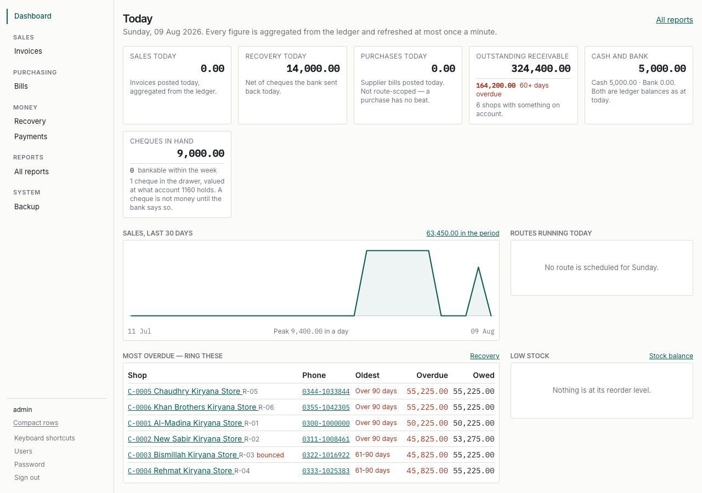
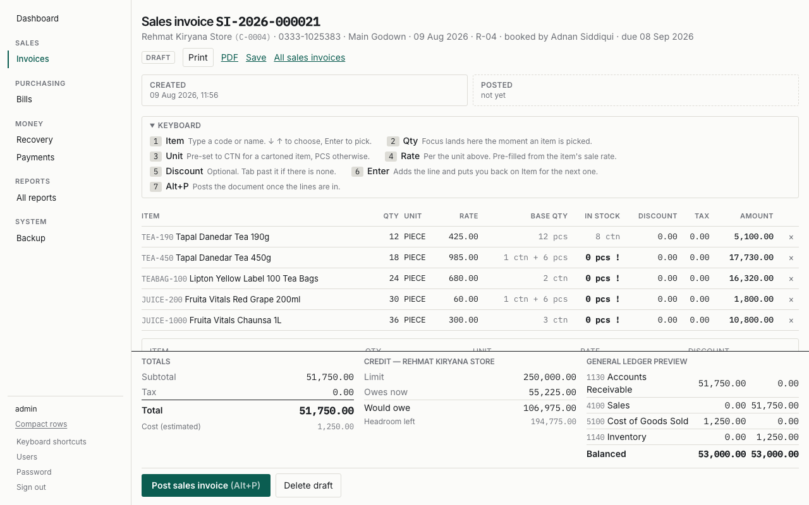
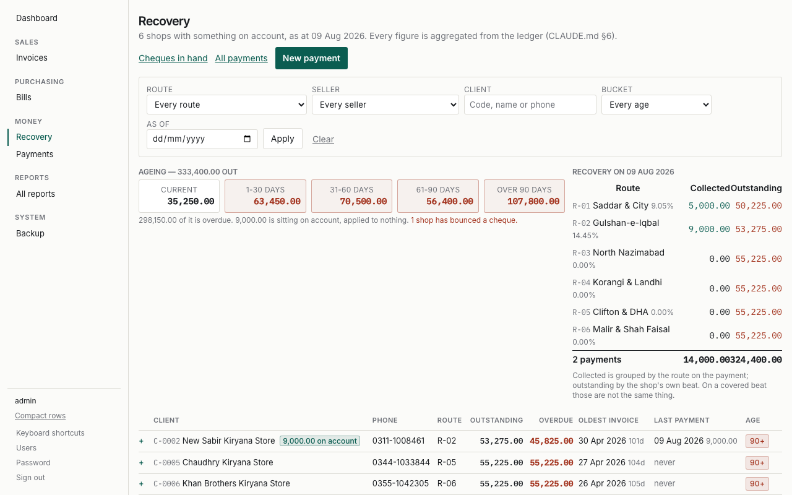
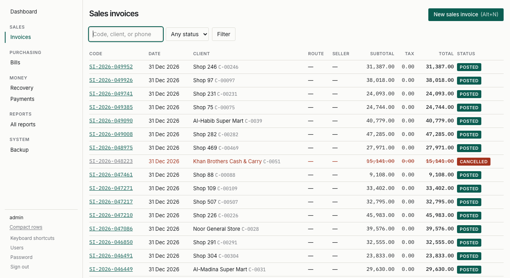
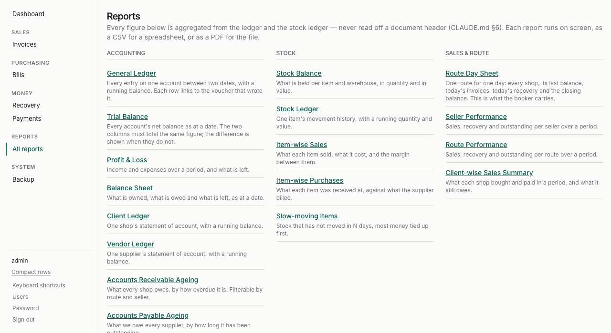
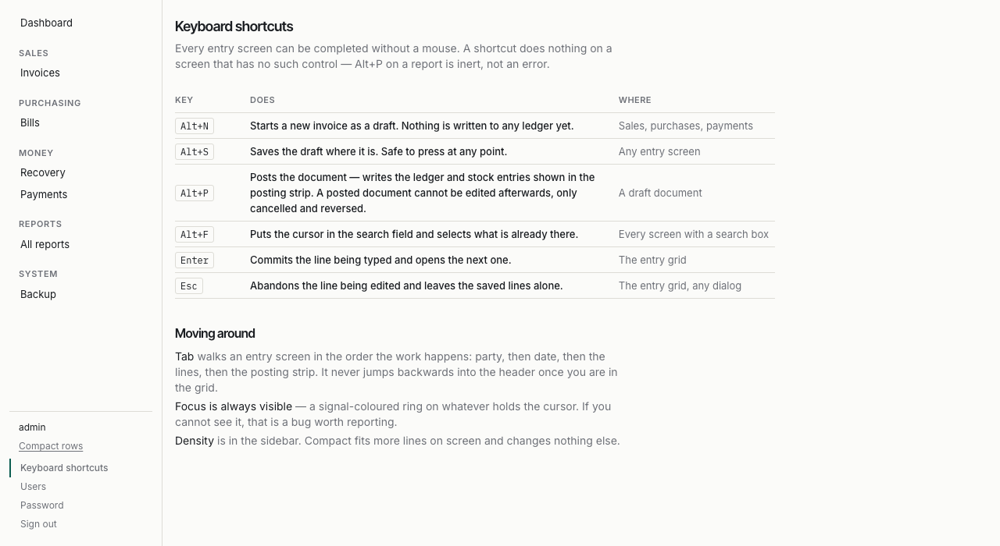

# Using the ERP

For the counter and for the accountant. Task by task, in the order a day
happens.

If you are setting the system up or managing logins, that is
[ADMIN-GUIDE.md](ADMIN-GUIDE.md). If you are changing the code, that is
[DEVELOPER.md](DEVELOPER.md).

---

## The one thing to understand first

**A document is a draft until you post it.** A draft has written nothing to the
accounts — you can change it, or delete it, and nothing has happened.

**Posting is what makes it real.** It writes to the ledger and the stock, and a
posted document can never be edited. That is on purpose: an invoice somebody
could quietly change after the fact is not a record of anything.

To correct a posted document you **cancel** it, which writes the exact opposite
entries and leaves both halves visible, and then **amend** the cancellation into
a new draft. Nothing is ever deleted and nothing is ever overwritten. If an
auditor asks what happened, the answer is on the screen.

---

## Today

Everything starts here. Every figure is worked out from the ledger when the page
loads, so it is what the books actually say and not a total somebody stored.

Every card links to the report that explains it — click the number to see where
it came from.

**Most overdue — ring these** is the working list. Phone numbers are links; on a
tablet they dial.

If a red banner appears above the cards saying the books do not balance, stop
and read [ADMIN-GUIDE.md](ADMIN-GUIDE.md#when-the-books-do-not-balance).

---

## Writing a sales invoice

1. **Sales → Invoices → New invoice** (or press <kbd>Alt</kbd>+<kbd>N</kbd>).
2. Type the shop's code, name or phone into the client box. Use ↓ and ↑ to
   choose, <kbd>Enter</kbd> to pick.
3. Press **Start entering lines**.

Then, for each line, without touching the mouse:

| Step | Field | What happens |
| ---- | ----- | ------------ |
| 1 | **Item** | Code or name. ↓ ↑ to choose, <kbd>Enter</kbd> to pick. |
| 2 | **Qty** | The cursor lands here as soon as an item is picked. |
| 3 | **Unit** | Pre-set to cartons for a cartoned item, pieces otherwise. |
| 4 | **Rate** | Per the unit above. Filled in from the item's sale rate. |
| 5 | **Discount** | Optional. <kbd>Tab</kbd> past it if there is none. |
| 6 | <kbd>Enter</kbd> | Adds the line and puts you back on Item for the next one. |

### The strip along the bottom

This is the part worth learning. It shows the running total on the left, the
shop's credit position in the middle, and **exactly what this invoice will do to
the accounts** on the right — which accounts get debited and credited, and by
how much.

It is there so a mistake is caught while you are typing rather than at
month-end. If the general ledger panel says **OUT OF BALANCE**, do not post;
tell the accountant.

### Credit limits

If the invoice would take the shop past its limit, the middle panel says so in
rust and the Post button explains what is needed. Only somebody with the
override permission can post it anyway, and the reason is recorded.

### Posting

Press **Post sales invoice** or <kbd>Alt</kbd>+<kbd>P</kbd>. After that the
document cannot be edited — only cancelled.

### Printing

**Print** uses the browser and is the fast way; use it for the counter copy.
**PDF** makes a file to email or file. Both read the same company details, so
they cannot disagree.

---

## Taking money in

**Money → Recovery** is the screen for collecting.

- The **ageing tiles** across the top break the outstanding money into how old
  it is. Anything overdue is in rust.
- **Click a shop's + sign** to open its unpaid bills and take a receipt against
  them without leaving the page.
- A receipt can be **on account** if the shop is paying something off a total
  rather than a particular bill.

### Cheques

A cheque is not money until the bank says so. Record it, and record what the
bank did afterwards — cleared or bounced — from **Money → Payments → Cheques in
hand**. A bounce writes its own reversing entry on the day it bounced; it does
not undo the receipt, because the receipt really did happen.

---

## Finding things

The search box takes a code, a name or a phone number. <kbd>Alt</kbd>+<kbd>F</kbd>
puts the cursor in it from anywhere.

**Cancelled documents are always listed**, struck through and marked. They are
never hidden — a cancelled invoice is usually exactly the one somebody is
looking for.

---

## Reports

Every report has the same filter bar, and every one offers **CSV** and **PDF**
with the same columns in the same order as the screen.

The ones used most:

| Report | Answers |
| ------ | ------- |
| **Receivable ageing** | Who owes us, and for how long |
| **Client ledger** | One shop's statement, with a running balance |
| **Day book** | Everything posted on a day |
| **Trial balance** | Whether the books balance. It must sum to zero |
| **Stock balance** | What is on hand, and what it is worth |
| **Route day sheet** | The paper a booker carries |

**Include cancelled documents** is on the filter bar. Leave it off for figures;
turn it on when you are auditing and want to see the reversals.

---

## Working faster

| Key | Does |
| --- | ---- |
| <kbd>Alt</kbd>+<kbd>N</kbd> | New invoice |
| <kbd>Alt</kbd>+<kbd>S</kbd> | Save the draft |
| <kbd>Alt</kbd>+<kbd>P</kbd> | Post |
| <kbd>Alt</kbd>+<kbd>F</kbd> | Jump to the search box |
| <kbd>Enter</kbd> | Commit the line, open the next |
| <kbd>Esc</kbd> | Abandon the line being typed |

**Compact rows** in the bottom-left of the sidebar fits more lines on screen. It
is remembered for your login. Operators usually want it; people reading ledgers
usually do not.

---

## When something goes wrong

**A message beside the field in rust** is the system refusing on purpose — over
the credit limit, not enough stock, a document that something else depends on.
Read it; it says what to do.

**A page saying "Something went wrong"** is a fault in the program. It will tell
you plainly that nothing was saved, and show a short reference like `PQ7K2MBX`.

1. Go back and try once more.
2. If it happens again, **stop, and do not re-enter the document** — part of it
   may have saved.
3. Tell whoever supports the system and read them the reference.

**A page saying your login may not do that** is a permission, not a fault. It
names the permission; an administrator can grant it.
